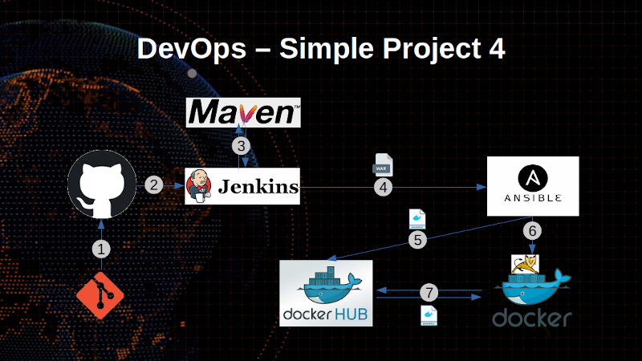

# Simple DevOps Project 4

  From the project we are AIM to deploy webapp_demo app on docker host with ansible playbook. The developer will develop code and push to `github` with `git`, creating `Jenkin` CI / CD job to build the `.war` file with `Maven` and coping `.war` file to `Ansible host`, creating a `docker tomcat image` by including copied .war file on Ansible host and push to `docker hub` repo. Finally docker host pulls the docker tomcat image from docker hub repo and deploy on `8080` port.

### Pre-Requirments

- [Jenkins](../../Jenkins/Jenkins_installation.md) with [Maven](../../Maven/Maven_installation.md) Server
- [Ansible](../../Ansible/Ansible_installation/) server
- [Docker](../../Docker/installation/) server
- Install [Publish over SSH](#publish_over_ssh) Plugin
- [Enable Connection](#connect_ansible_jenkins) between Ansible and Jenkins
- Setup Ansible to Docker host [passwordless connection](#connect_ansible_docker)
- Create account on Docker Hub and Configure login on Ansible and Docker host with `dockeradmin` user

#### Install `Publish over SSH` plugin

Jenkins Dashboard >> `Manage Jenkins` > `Manage Plugins` > `Available` > `Publish over SSH` and click `install without restat` button

#### Enable Connection between Ansible and Jenkins

Jenkins Dashboard >> `Manage Jenkins` > `Configure System` > `Publish Over SSH` > `SSH Servers`

- SSH Servers:
  - Name : `ansible_host`
  - Hostname: `<ansible_ServerIP>`
  - username: `ansadmin`
  - password: `*******`

Test the connection by clicking `Test Connection` and save

#### Setup Ansible to Docker host passwordless connection

- Create `dockeradmin` user, add to `docker` group on both ansible and docker hosts
~~~sh
sudo useradd dockeradmin
sudo passwd dockeradmin
sudo usermod -aG docker dockeradmin
~~~
- Add to `dockeradmin` to sudoer on both Ansible and Docker hosts.
~~~sh
echo "dockeradmin	ALL=(ALL:ALL) NOPASSWD: ALL" >> /etc/sudoers
~~~
- Uncommnet `PasswordAuthentication` option set to `yes` in `/etc/ssh/sshd_config` on both Ansible and Docker hosts as followss
~~~sh
sudo vi /etc/ssh/sshd_config
#uncomment and change the below option to 'no' to 'yes'
PasswordAuthentication yes
~~~
- Login to Ansible server as `dockeradmin` user generate SSH key and copy to docker host.
~~~sh
su dockeradmin
ssh-keygen
ssh-copy-id dockeradmin@<docker-host-IP>
~~~

#### Create an docker image

- Login to Jenkins portal
- Create _Jenkins job_, Fill the following details,
  - Source Code Management:
    - Repository : `https://github.com/ValaxyTech/hello-world.git`
    - Branches to build: `*/master`
  - Build:
    - Root ROM: `pom.xml`
    - Goals and options: `clean install package`
  - Post Steps:
    - Send files or execute commands over SSH
      - Name: `ansible_server`
      - Source files : `webapp/target/*.war`
      - Remove prefix : `webapp/target`
      - Remote directory : `//opt//docker`
  - Send files or execute commands over SSH
    - Name: `ansible_server`
    - Source files : `Dockerfile`
    - Remote directory : `//opt//docker`
    - Exec Command:
      -
      ~~~sh
      cd /opt/docker
      docker build -t webapp_demo .
      docker tag webapp_demo mkn400/valaxy_demo
      docker push mkn400/webapp_demo
      docker rmi webapp_demo mkn400/webapp_demo
      ~~~
  - Login to Docker host and check images and containers. (no images and containers)
  - Login to docker hub and check. shouldn't find images with for `webapp_demo`
  - Execute Jenkins job
  - Check images in Docker hub. Now you could able to see new images pushed to mkn400 Docker_Hub

#### Troubleshooting:
- Docker should be installed on ansible server
- Should login to "docker hub" on ansible server
- `dockeradmin` user should be part of docker group

In next step we create `create_docker_container.yml` playbook. this get intiated by jenkins job, run by `ansible` and exected on `dokcer host`

#### Deploy Containers

- Write a yml file to create a container (file name : create_docker_container.yml) on `/opt/playbooks`

~~~sh
mkdir /opt/playbooks
cd /opt/playbooks
vi create_docker_container.yml

---
  - hosts: web-servers
    become: true
    tasks:
     - name: stop previous version docker
       shell: docker stop webapp_demo
     - name: remove stopped container
       shell: docker rm -f webapp_demo	  
     - name: remove docker images
       shell: docker image rm -f mkn400/webapp_demo
     - name: create docker image
       shell: docker run -d --name webapp_demo -p 8090:8080 mkn400/webapp_demo
~~~

- Add this script to `Jenkins job`.
  - Chose "configure" to modify your jenkins job.
    - Under post build actions
      - Send files or execute commands over SSH
        - Exec Command:
        ~~~sh
        cd /opt/playbooks
        ansible-playbook create_docker_container.yml
        ~~~
- Execute Jenkins job.

- You could see a new container on your docker host. can able access it from browser on port 8090

:exclamation: Makesure you have opened required ports on AWS Security group for this server. :exclamation:

#### Deploy with Version Control Containers

So for we used latest docker image to build a container, but what happens if latest version is not working?
One easiest solution is, maintaining version for each build. This can be achieved by using environment variables.

Here we use a variables called `BUILD_ID` - The current build id of the job. For more info kindly _**[click here](https://wiki.jenkins.io/display/JENKINS/Building+a+software+project)**_

All are same as `Create an docker image` above. but change `Send files or execute commands over SSH` section as follows.

- Send files or execute commands over SSH
  - Name: `ansible_server`
  - Source files : `Dockerfile`
  - Remote directory : `//opt//docker`
  - Exec Command:
    -
    ~~~sh
    cd /opt/docker
    docker build -t webapp_demo:v1.$BUILD_ID .
    docker tag webapp_demo:v1.$BUILD_ID mkn400/webapp_demo:v1.$BUILD_ID
    docker tag webapp_demo:v1.$BUILD_ID mkn400/webapp_demo:latest
    docker push mkn400/webapp_demo:v1.$BUILD_ID
    docker push mkn400/webapp_demo:latest
    docker rmi webapp_demo:v1.$BUILD_ID mkn400/webapp_demo:v1.$BUILD_ID
    mkn400/webapp_demo:latest
    ~~~

_I'm Happy To Get [Suggestions](https://forms.gle/UPiN8UrHikj9UR5UA)_ :smile:
